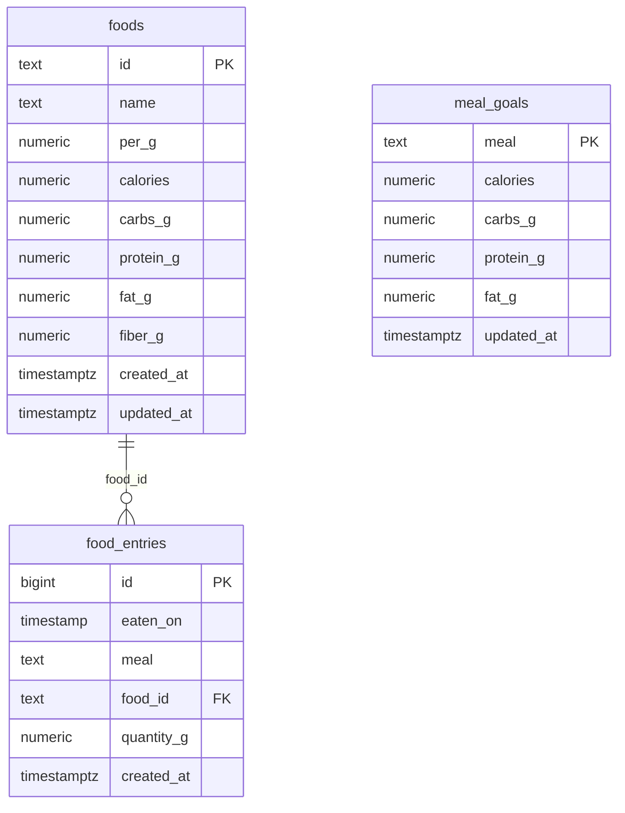

# calcunt database schema

This document describes the deployed PostgreSQL schema in the Supabase project
`calcunt` (project reference `lncciiekrzsvfjjuumbu`). The application uses the
`public` schema and exposes its three tables through the Supabase Data REST API.

## Data model



## `public.foods`

One row per distinct food. Nutrition values are stored relative to `per_g`,
which is normally 100 grams. A food is reused by any number of log entries.

| Column | Type | Rules | Meaning |
| --- | --- | --- | --- |
| `id` | `text` | Primary key; snake-case slug | Stable food identifier, such as `rice_white_cooked` |
| `name` | `text` | Required; non-empty | Display name |
| `per_g` | `numeric` | Required; `> 0`; default `100` | Gram basis for the nutrition values |
| `calories` | `numeric` | Required; `>= 0` | Kilocalories per `per_g` grams |
| `carbs_g` | `numeric` | Required; `>= 0` | Carbohydrates per `per_g` grams |
| `protein_g` | `numeric` | Required; `>= 0` | Protein per `per_g` grams |
| `fat_g` | `numeric` | Required; `>= 0` | Fat per `per_g` grams |
| `fiber_g` | `numeric` | Required; `>= 0` | Fiber per `per_g` grams |
| `created_at` | `timestamptz` | Required; default `now()` | Creation timestamp |
| `updated_at` | `timestamptz` | Required; default `now()` | Last-update timestamp; callers must update it explicitly |

The `id` constraint accepts lowercase letters, digits, and single underscore-
separated segments. It rejects spaces, uppercase letters, and leading,
trailing, or repeated underscores.

## `public.food_entries`

One row per food item eaten. A meal containing rice and chicken is represented
by two rows. Nutrition totals are intentionally not stored here: the frontend
derives them from `quantity_g` and the referenced `foods` row.

| Column | Type | Rules | Meaning |
| --- | --- | --- | --- |
| `id` | `bigint` | Primary key; generated identity | Entry identifier |
| `eaten_on` | `timestamp without time zone` | Required | Eating date and wall-clock time |
| `meal` | `text` | Required; allowed values below | Meal category |
| `food_id` | `text` | Required; foreign key to `foods.id` | Food eaten |
| `quantity_g` | `numeric` | Required; `> 0` | Quantity eaten in grams |
| `created_at` | `timestamptz` | Required; default `now()` | Creation timestamp |

Allowed `meal` values are:

- `breakfast`
- `lunch`
- `dinner`
- `snack`

The foreign key uses `ON UPDATE CASCADE` and `ON DELETE RESTRICT`. Renaming a
food ID updates its entries; deleting a food referenced by an entry is blocked.

`eaten_on` is a timezone-free calendar timestamp. It records the day and clock
time of eating exactly as entered, without geographic timezone conversion. The
40 rows migrated from GitHub originally contained dates only, so they use these
meal-specific defaults:

| Meal | Default wall-clock time |
| --- | --- |
| `breakfast` | `09:00` |
| `lunch` | `14:00` |
| `dinner` | `20:00` |
| `snack` | `23:00` |

Future entries must also contain a time. When the user does not supply one,
the same meal-specific defaults are used and disclosed in the confirmation.

## `public.meal_goals`

Exactly one goal row is expected for each meal category. Daily goals are not
stored separately: the frontend sums the four meal rows.

| Column | Type | Rules | Meaning |
| --- | --- | --- | --- |
| `meal` | `text` | Primary key; same four allowed values | Meal category |
| `calories` | `numeric` | Required; `>= 0` | Calorie target |
| `carbs_g` | `numeric` | Required; `>= 0` | Carbohydrate target in grams |
| `protein_g` | `numeric` | Required; `>= 0` | Protein target in grams |
| `fat_g` | `numeric` | Required; `>= 0` | Fat target in grams |
| `updated_at` | `timestamptz` | Required; default `now()` | Last-update timestamp; callers must update it explicitly |

There is no fiber goal because fiber is displayed but is not part of the
goal-based visualizations.

## Derived nutrition

For each entry and nutrient, the application computes:

```text
entry_value = food_value * food_entries.quantity_g / foods.per_g
```

For example, 150 g of a food containing 130 kcal per 100 g contributes
`130 * 150 / 100 = 195 kcal`. Keeping derived values out of `food_entries`
means correcting a food label automatically corrects all historical totals.

## Indexes

| Index | Definition and purpose |
| --- | --- |
| `foods_pkey` | Unique B-tree index on `foods(id)` |
| `food_entries_pkey` | Unique B-tree index on `food_entries(id)` |
| `food_entries_eaten_on_meal_idx` | B-tree on `(eaten_on DESC, meal, id)` for chronological application reads |
| `food_entries_food_id_idx` | B-tree on `(food_id)` for joins and foreign-key maintenance |
| `meal_goals_pkey` | Unique B-tree index on `meal_goals(meal)` |

## Data API and row-level security

Row-level security is enabled on all three tables. Each table has one policy
allowing `SELECT` to the `anon` and `authenticated` roles with `USING (true)`:

| Table | Policy |
| --- | --- |
| `foods` | `public read foods` |
| `food_entries` | `public read food entries` |
| `meal_goals` | `public read meal goals` |

There are no RLS policies for `INSERT`, `UPDATE`, or `DELETE`. Consequently,
requests using the public publishable key can read all rows but cannot change
them. Administrative connections that bypass RLS, including the connected
Supabase management workflow used from ChatGPT, can add or update data.

The Supabase project currently grants the standard Data API table privileges
to `anon` and `authenticated`. RLS is therefore the effective row-access
boundary and must remain enabled.

Never place a Supabase secret key or legacy `service_role` key in the website.
The frontend should use only the publishable key.

## Writing a meal entry

1. Resolve the food to an existing `foods.id`.
2. If it is new, insert its nutrition values into `foods`, normalized to a
   100 g basis.
3. Insert one `food_entries` row per food item, using the eating date and time,
   meal category, food ID, and quantity in grams.
4. Do not calculate or store entry calories or macronutrients.

Example administrative transaction:

```sql
begin;

insert into public.foods
  (id, name, per_g, calories, carbs_g, protein_g, fat_g, fiber_g)
values
  ('rice_white_cooked', 'White rice, cooked', 100, 130, 28.2, 2.7, 0.3, 0.4)
on conflict (id) do nothing;

insert into public.food_entries (eaten_on, meal, food_id, quantity_g)
values ('2026-08-10 14:00:00',
        'lunch', 'rice_white_cooked', 150);

commit;
```

## Current deployed contents

At the time this document was generated, the database contained:

- 50 foods
- 40 food entries
- 4 meal goals
- 0 food entries with a missing food reference

## References

- [Supabase Row Level Security](https://supabase.com/docs/guides/database/postgres/row-level-security)
- [Securing the Supabase Data API](https://supabase.com/docs/guides/api/securing-your-api)
- [Supabase API keys](https://supabase.com/docs/guides/api/api-keys)
